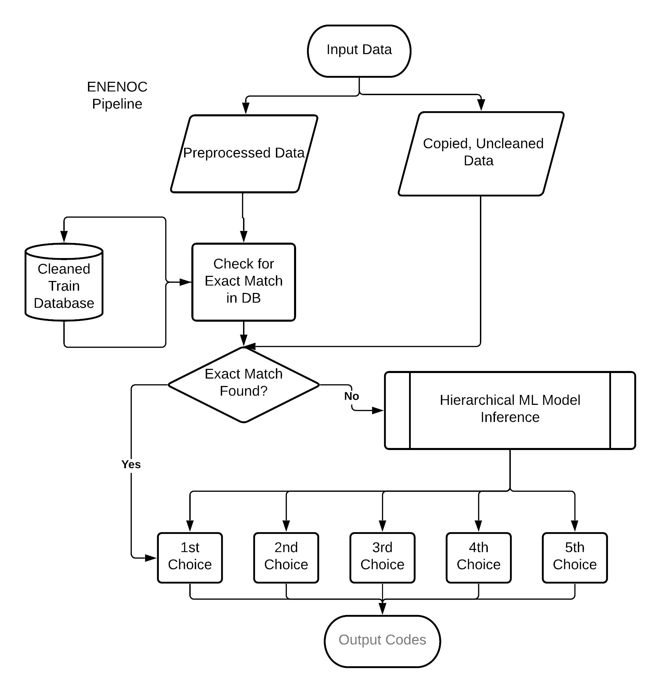
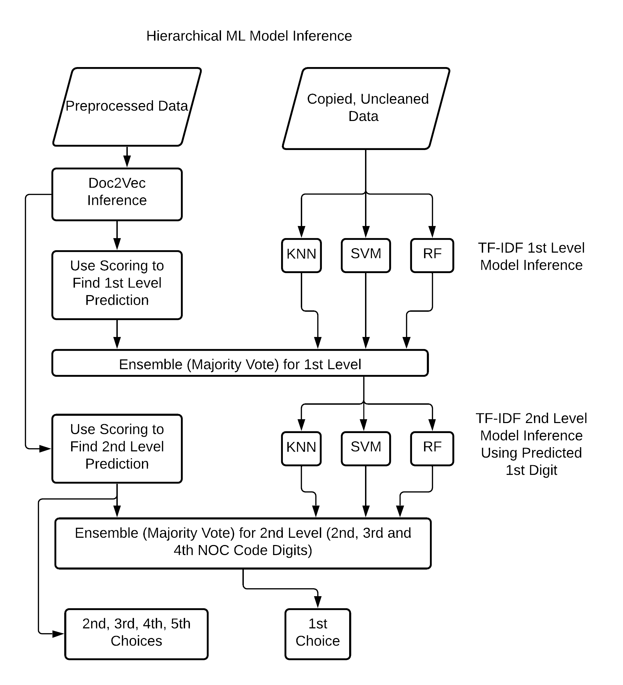

# Automated Occupational Encoding using an Ensemble Classifier from TF-IDF and Doc2Vec Embeddings
## CS 4993 Honor’s Project - Cesar Augusto Suarez
### University of New Brunswick - January 2021

## Abstract
Occupational encoding is a technique that allows individuals to be categorized according to their role in the labor force. 
This categorization happens in accordance to a set of rules provided by the country’s national government. 
Examples of this are the Standard Occupational Classification (SOC) in the United States of America, and the Government of
Canada’s National Occupational Classification (NOC). Nonetheless, taking an individual’s job information and manually encoding it is both costly
and time consuming. This project uses an artificial intelligence strategy to improve upon previous automated encoding approaches and reduce the
amount of manual labor needed for the task of encoding. We leverage classical machine learning techniques (Random Forests, SVM’s and KNN
classifiers) as well as Doc2Vec, a neural network specialized in the extraction of semantics, to build ENENOC (the ENsemble Encoder for the
National Occupational Classification). At a 5% significance level, our machine learning pipeline shows stronger classification results than the
previously developed ACA-NOC at both a macro and micro level.

## Our Pipeline
The proposed machine learning pipeline differs from other approaches because it combines the benefits of
thorough data cleaning, exact matching, model ensembling, hierarchical classification, and multiple output selection. Our system contains a series of steps
through which the data, in different forms, flows. It begins with the input data being copied, with one copy being preprocessed 4.1, and the other left
unprocessed. The processed data is fed into an exact match search, where it is cross-referenced with our training database (which was also preprocessed).
At this point, if an exact match of the new data is found, the program returns the code associated with the matching training entry as its top result. If an
exact match is not found, the uncleaned data is embedded using the TF-IDF algorithm (section 2.2.1) and the cleaned data is embedded using the Doc2Vec
network (section 2.2.2). The different embeddings are fed into a hierarchical, ensemble classifier which produces multiple results, taking into consideration the
TF-IDF classifiers, the Doc2Vec neural network, and the aforementioned exact search. The following sections provide further detail on each of these steps. A
flow chart of the proposed model can be seen in the first figure below and a detailed view of the hierarchical prediction process is shown in the second figure below.




## Requirements
You need to have a computer with all the necessary dependencies installed. To install the dependencies, run one of the following commands based on your python package handler.

### Conda
```conda install --file requirements.txt```

### Pip
```pip install -r requirements.txt```


## To run the full machine learning pipeline
Navigate to the ```scripts``` directory and run:
```python MLpipeline.py -t <test set> -j <List of job titles for single inference. Necessary when one_inference flag set.> -i <Name of column specifying job titles>  -c <Name of column specifying NOC Codes> -s <Sample size to be taken randomly from test set> -o <Perform inference on a single job title. Defaults to not being set>  -d <Path to doc2vec .model file> -n <Number of times to run. Will overide to randomize random seed and will check for sample size to be set.> -r <Randomize the seed used for sampling. If not set, a sample of fixed size will always produce the same results.>```

Note that many of these flags are either optional, or only appear with other flags. A more commonn run example would be:

```python MLpipeline.py -t ../Data/ATP.csv```

Which uses the path to a pre-existing dataset in the "Data" folder. This will output a .csv file with all the prediction pipeline steps, including the top 5 ENENOC predictions.

An example for inference on a single, custom job title would be:

```python MLpipeline.py -o -j "music teacher"```

which will output the top 5 ENENOC results as a string.